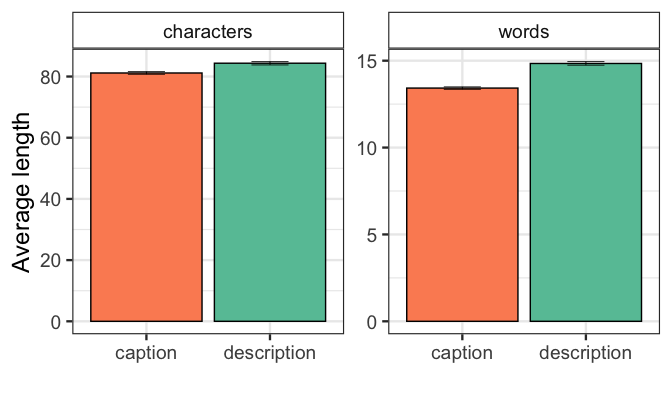
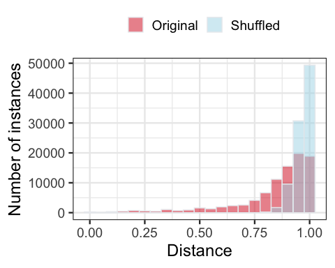
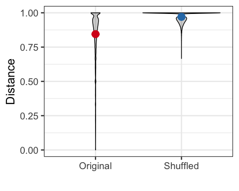

Wikipedia Caption Analysis
================

<!-- num_of_articles: 19,852,811 -->
<!-- num_of_potential_descrcaptionpairs: 232,798 -->
<!-- starts_with_file: 2,205,414 -->
<!-- starts_and_ends_with_file: 2,103,530 -->
<!-- contains_file: 6,674,003 -->
<!-- contains_img: 10,960,862 -->
<!-- no_descr: 26,134 -->
<!-- no_caption: 88,805 -->
<!-- short_descr: 22,198 -->
We crawled 19,852,811 Wikipedia articles with 10,960,862 image files.

The corpus consists of 37,560 Wikipedia articles (0.19%) and 92,406 data points, where each data point is an image with a corresponding caption and description (0.84%).

Length difference
=================

Descriptions are longer but captions have longer words.

There is no correlation of description and caption length (here, measure in number of words), i.e., it's not the case that images that receive long captions, also receive long descriptions and vice versa.

Similarity between captions and corresponding descriptions
==========================================================

Most frequent words
===================

Captions require a bigger vocabulary/lexicon (12% of all word occurrences are unique) than descriptions (8% of all word occurrences are unique).

Descriptions in green and captions in red. "th" and "st" are probably from 24**th** and **st**reet.

### Description

Meta-information, e.g., *photograph*, *photo*, and probably *black* and *white* from *black and white photograph*. Colors in general (*white, black, red, blue*), location (*left, front*) and descriptive primitives (*wearing, map*).

    ## # A tibble: 10 x 2
    ##    word           n
    ##    <chr>      <int>
    ##  1 white      11519
    ##  2 black       8891
    ##  3 wearing     7978
    ##  4 photograph  5716
    ##  5 left        5193
    ##  6 red         4684
    ##  7 blue        4331
    ##  8 photo       4301
    ##  9 map         4242
    ## 10 front       4019

### Caption

Less primitive descriptives (like colors) and more extra-image information (*won, century, john, view, 2009*).

    ## # A tibble: 10 x 2
    ##    word         n
    ##    <chr>    <int>
    ##  1 left      3333
    ##  2 1         2125
    ##  3 map       2107
    ##  4 pictured  2021
    ##  5 won       1787
    ##  6 view      1538
    ##  7 century   1458
    ##  8 de        1416
    ##  9 2         1410
    ## 10 john      1385

Word frequency difference
-------------------------

Highly correlated (Pearson: *r=0.50*, *p&lt;0.0001*), but clear patterns.

Ngram analysis
==============

### Most frequent trigrams with stopwords

Captions contain proper names (*united states*, *tour de france*), addresses events (*the battle of*) and extra-information (*part of the*, *was the first*, *of the first*). Descriptions contain a variety of locations (*foreground, background, front, left*), basic category reference to a person (*man*), clothing descriptives (*wearing*) and meta-photo information (multiple variants of *black and white photograph*).

### Most frequent bigrams without stopwords

Captions are dominated by events and proper names. Descriptions are dominated by terms relating to appearance.

